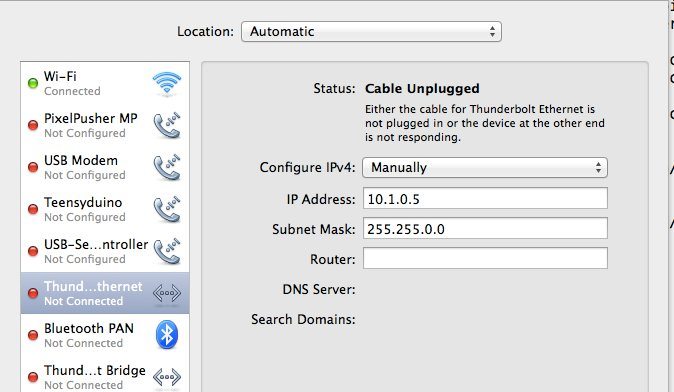
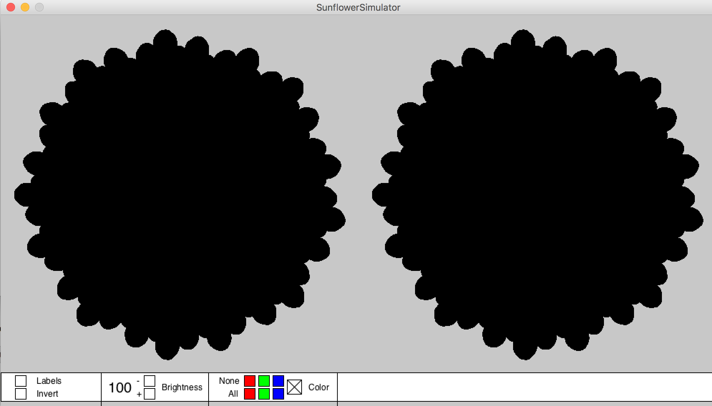
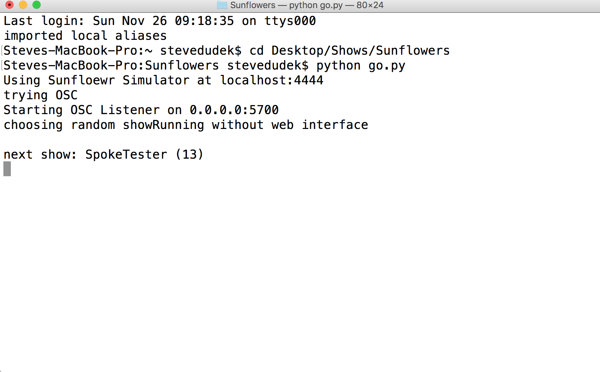

# Sunflowers Documentation

November 25, 2017
 

## Sections

* Sunflowers Installation
* Hardware Connections
* Processing
* The Terminal
* Show Controls
* Technical Notes and Contact Information

## Sunflowers Installation

Suspend each Sunflower vertically by two cables secured to the aluminum hoop of each sunflower.

Although sunflower orientation is not crucial, it is easiest to position the connector cables pointing up so that the connecting wires are closest to the Pixel Pusher and requiring the least amount of wire.

Don't pull on the Sunflowers 4-strand connection wire as that solder joint is both fragile and a pain to fix. If you can, first loop the 4-strand wire once around the frame to relieve strain and prevent tearing the electronic connection.

## Hardware Connections

### Sunflowers

Connect two block-terminal extender cables as needed to wire the each Sunflower to a centralized spot where the following lives together: Pixel Pusher, power supply, hub, and laptop.

The extender cables have male and female ends much like extension cords.

Plug the cables into the Pixel Pusher ports. One Sunflower will take up strips 1 & 2, and the other strips 3 & 4. When disconnecting a cable from the Pusher, disconnect it at the block junction and not at the Pusher. The pins on the Pusher are fragile, and if we mush them, we're screwed.

### Pixel Pusher

The Pusher has 5 connectors already seated: 4 you need and 1 extra. You can read the strip numbers in white letters on the Pusher, like "Strip 1."

### USB Stick

No USB Stick needed. The Pixel Pusher is already hardware configured

### Hub

Plug the Hub into a power strip with the included wallwart adapter. Connect a long and a short ethernet cable to any ports on the hub. The long cable runs from the hub to the laptop through an ethernet-to-USB dongle. The short cable runs from the hub to the side (and only) ethernet port on the black Pixel Pusher.

Your computer needs talks to the hub with these settings:

If you are set up right, you should be able to type "ping 10.1.0.20" from the Terminal and see a response

### Computer

Plug the computer's power into that power strip.

As mentioned above in the “Hub” section, connect a 2nd ethernet cable from the computer to the hub. I have been using port 1.

### Power Supply

Plug in the silver power supply. A green light should come on in the power supply. Plug the power supply into the Pixel Pusher.

### Starting or Rebooting the 2 Software Packages

## Processing

Wireless chatter can interfere with the communication from the laptop to the Pixel Pusher, so TURN WI-FI OFF.

Boot up Processing2. Use the older Processing2 and not the newer Processing3, even if on start-up, the Processing software prompts you to update the version. Open “SunflowerSimulator.pde" in Processing.

In Processing, press the triangle arrow 

to start the SunflowerSimulator.pde. It should boot java to present the Sunflowers simulator.

## The Terminal

Open a terminal, either by finding the terminal program in the dock (looks like a black rectangle with a white >_ ) or search in Spotlight for “Terminal”. Switch to the Sunflower directory on the Desktop. For me, this means first typing:

	$ cd Desktop/Sunflower

Type:

	$ python go.py

The simulator should display the current show. The Sunflowers should light up. Check the Sunflower lights against the Simulator to see whether you read the connections correctly.

## Show Controls

You can change the lighting in the following ways:

### Brightness

That bold 100 is % Brightness. You can dial down the brightness to 1%. Background pixels take longer to refresh brightness so brightness changes may not be immediately apparent for all pixels.

### Color

Only one of the 7 boxes can be checked at a time. Checking the large white box means no color correction. Color correction is useful to warm the display into reds and yellows. Try color correction before show time so you know what you are getting into.

##### None

Exclude this color from the palette.

##### All

Always present this color.

### Video

Avoid pressing either the Video or Next gif buttons

### Shows

Shows are picked randomly and run for 60 seconds. If you want longer or shorter shows, run a different script command with the time in seconds (180 seconds shown below):

	python go.py --max-time 180
	
## Technical Notes

### Contact information

##### Stephen Dudek
781-223-8626
stevedudek@gmail.com

##### Tom Landers
617-308-5303
galaxyglue@gmail.com

